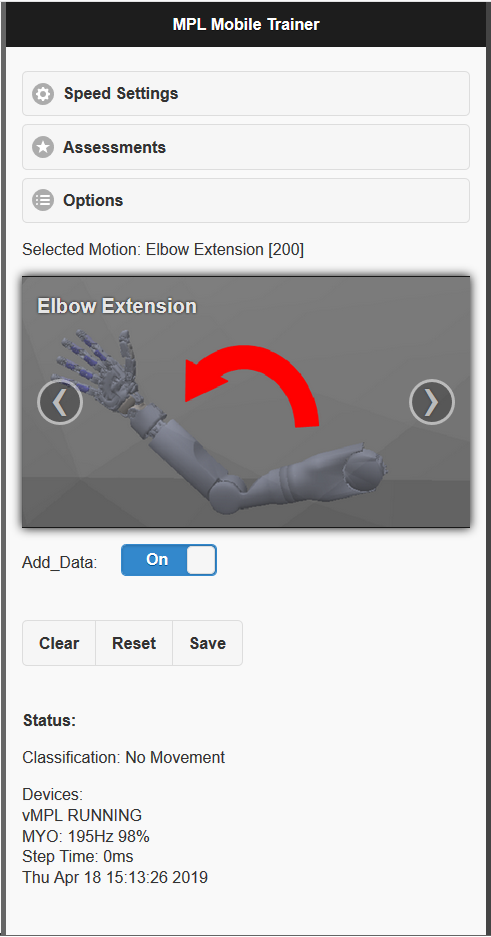
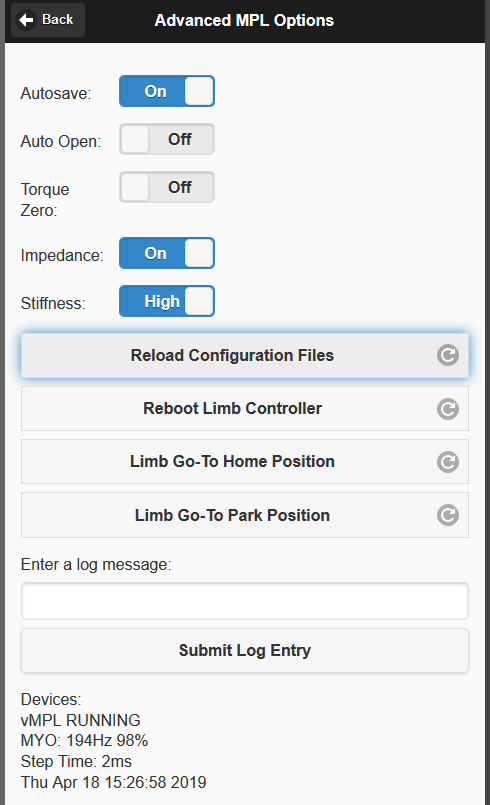

# Python MiniVIE - Virtual Integration Environment for Prosthetic Control
> The objective of the PythonVIE is to provide the essential BioSignal Acquisition, processing, and output modules to 
control prosthetic limb ranging in complexity from open source 3d printed arms, to advanced dexterous arms such as 
the JHUAPL Modular Prosthetic limb.



## PythonVIE System Overview

The basic workflow of the _PythonVIE_ is as follows:

### Input: 
Signal Acquisition of a variety of signal types ranging from wireless surface electromyography (sEMG) devices such
as the Thalmic Myo Armband, to generic data acquisition (DAQ) using National Instruments USB DAQ such as the USB-6001,
to customized bio amplification hardware such as the Intan RHD chipset
    
### Signal Analysis: 
This module handles the data signal processing and links to machine learning tools.  Initially this is integrated
with the sklearn toolbox, but others can be added or customized as necessary.
An important submodule to this is 
1) The ability to store and load data for machine learning approaches (TrainingData) and 
2) An interface module for controlling data labeling and management (TrainingInterface).
    
### Plant: 
The _plant_ (used in the Control Theory sense) is the model of the control system (such as an arm) that has state information
(i.e. hold the current position of the arm), as well as the range of motion and speed limits.  A new control command might send a 
velocity command to the joint, in which case it is the job of the plant to store the incremented position and stop when the range
of motion is exceeded
    
### Presentation:  
The 'presentation' refers generically to the output of the system, whether a physical or virtual arm. 

### Scenario: 
Scenario objects contain different combinations of the above modules to develop specific use-cases.  This could be wireless electrodes
controlling a virtual limb system, or synthetic (stored) data used to control a physical arm for testing, or any combination thereof.
	
## About config files

The PythonVIE can be run with default options only by calling the main program (`run_www.py`) from the command line directly.
More likely however, a _user_config.xml_ file will be used to customize the program.

The specific _user_config.xml_ file is referenced when launching the `run_www.py` program using the `-x` option

See the [_user_config_default.xml_](../minivie/user_config_default.xml) file as a template for customizing parameters

```sh
cp user_config_default my_config_file.xml
```

## Running the program

OS X & Linux:
```sh
python3 run_www.py -x my_config_file.xml
```

Windows:
```sh
py -3 run_www.py -x my_config_file.xml -l DEBUG
```

The _user_config.xml_ file contains info such as the joint limits, web app parameters, speed, and others.  This shouldbe familiar to VulcanX users
as the config file mimics that config file format (those these are NOT interchangeable or necessarily compatible)

Of note, the config file references a ROC Table file as follows:

    <!--ROC Table to be loaded and interpolated locally during MiniVIE Session-->
    <add key="MPL.roc_table"         value="VMPL_ROC.xml"/>

This can also include file path information as in:

    <!--ROC Table to be loaded and interpolated locally during MiniVIE Session-->
    <add key="MPL.roc_table"         value="../../WrRocDefaults.xml"/>

where the path is relative to the python working directory

Lastly, run-time parameters such joint limits and speed or impedance settings can be updated while the system is running.
To do so, select the following from the web-app:

Options > MPL Configuration... > Reload Configuration Parameters



For other parameters such as the web app port, the run_www.py program will need to be restarted.  E.g.:

1. If running from a command line terminal:

    CTRL+C, followed by python3 run_www.py
	
2. Via an ssh terminal
    ```sh
    sudo systemctl restart mpl_run_www.service
    ```
3. Or via a reboot / power cycle of the arm


	
## Notes on PyCharm Community Edition IDE
If installing on a new windows build and you don't have other IDE preferences:
1. Download and Install PyCharmCE
2. Download and Install Python3.6+
3. Open Pycharm and select the MiniVIE project directory (e.g. c:\git\minivie)
4. Set Project Settings (File->Settings...)
    * Project Structure
    * Content Root Default: c:\git\minivie\python
    * Sources Root Default: minivie
5. Once launched, pycharm should check for and install project dependencies (Note on windows bluepy is not supported)
6. Click Install requirements

## Style and Programming Best Practices

### UDP

Many of the modules communicate via UDP.  UDP is chosen because it is a lightweight communications protocol suitable for real-time control. The
major downside is that the communication packet is not 'guaranteed' to arrive in the correct order, or arrive at all.  However, given a real-time system
that updated 20-50 times per second, a 'new' packet is usually available in the time it would take to perform error correction of a dropped packet.  The 
other advantage is to have multiple listeners or senders (e.g. an embedded system and a PC receiving data allowing simultaneous physical and virtual system 
control).

Examples of UDP communication are:

One process to collect wireless bluetooth EMG.  This would be a simple 'program' that reads from a bluetooth socket and streams data via UDP
A second process to receive UDP packets and perform classification and signal processing

One process to send UDP joint commands formatted for a particular device (e.g. virtual limb).  This would allow a second computer (e.g. VR rendering PC, or 
Augmented reality Hololens to receive and display the information.  This also allows program communcation across programming languages (e.g. Python sending 
data to an embedded C program (running on Arduino) to allow communication)

### Printing and Logging

Use Python's logging module to log any errors/warnings. The log file is set up in the utilities/user_config.py file.  This allows controlling the level of messages
that are displayed for any given module.  Within code just issue one of the following instead of print:

    logging.info(your_string)
    logging.warning(your_string)
    logging.error(your_string)
    logging.debug(your_string)


### Web interface

The mobile interface for the PythonVIE uses websockets to communicate from the embedded device to a web browser (PC, Mac, Mobile Phone).  Websockets allow
dynamic real-time updates of the website for streaming information like the current position, selected motion, or system status.  The current implementation 
of websockets uses the Spacebrew project, though this may be removed in future versions in favor of more low-level communcations.
All commands and messages between the device and the controller are handled through formatted web-sockets allowing bi-directional communcation

### Debugging via command line
See this [blog on making putty debugging more readable](http://swimminginthought.com/putty-ssh-dark-blue-directory-listing-unreadable-quick-fix/)

From blog post:

_If you use putty (as do I), here’s the quick solution to fixing that horrible Dark Blue Color for those directory entries.
Start Up Putty and go to Settings.
Select “Session” on the right and “Default Settings” on the bottom Right. Hit the Load button to load the default settings.
Select “Colors” under the “Window” tree on the left.  Scroll down and highlight ANSI Blue and pop in the following values:  
(R: 255,  G: 255, B: 0)  Do the same for Ansi Blue Bold._


## Design Patterns

Below are a few frequently used design patterns in the PythonVIE

### Running a python module stand-alone

The base of the project is 

    /git/minivie/python/minivie

As such, typical modules will import assuming this is the base
Example:

    from utilities import user_config
    from scenarios import mpl_nfu
    from mpl.open_nfu import NfuUdp

However if a module is to be run stand-alone from a directory (e.g. /git/minivie/python/minvie/gui), the module won't be found
Example:

    C:\git\minivie\python\minivie\gui>python test_live_plot.py
    Traceback (most recent call last):
      File "test_live_plot.py", line 4, in <module>
        from inputs import myo
    ModuleNotFoundError: No module named 'inputs'

Option 1:
Execute the submodule from the project home:

    python -m gui.test_live_plot

Option 2: 
Make the module add the project home to the path by adding the following to the code [Not recommended].
While this not be the most robust, it allows 'double click' access to the module

    # Ensure that the minivie specific modules can be found on path 
    # allowing execution from the 'inputs' folder
    if os.path.split(os.getcwd())[1] == 'inputs':
        import sys
        sys.path.insert(0, os.path.abspath('..'))
    import inputs

### Byte packing
Pack a variable length list of floats

    import random
    import struct

    floatlist = [random.random() for _ in range(10**5)]
    buf = struct.pack('%sf' % len(floatlist), *floatlist)

Pack a fixed length list of values
([**For example see unity.py**](../minivie/mpl/unity.py))

    import struct

    joint_angles = [0.0] * MplId.NUM_JOINTS
    rad_to_deg = 180/math.pi
    msg = 'JointCmd: ' + ','.join(['%d' % int(elem*rad_to_deg) for elem in joint_angles])
    logging.debug(msg)

    packer = struct.Struct('27f')  # use f for single, d for double, h for short 
    packed_data = packer.pack(*joint_angles)
    sock.send(packed_data)

Unpack fixed length byte values
([**For example see myo.py**](../minivie/inputs/myo.py))

    import struct
    import socket

    # Unpack 'mixed' bytes into data structure.  
    # In this case '8b4f3f3f' is 
    # [EMG] @ 8 signed char 
    # [Quaternion] @ 4 signed floats
    # [Acceleration] @ 3 signed floats
    # [Angular Rate Gyro] @ 3 signed floats
    data, address = sock.recvfrom(1024)
    output = struct.unpack("8b4f3f3f", data)

    # Populate EMG Data Buffer (newest on top)
    dataEMG = np.roll(dataEMG, 1, axis=0)
    dataEMG[:1, :] = output[:8]  # insert in first buffer entry
    
    # IMU Data Update
    quat = output[8:12]
    accel = output[12:15]
    gyro = output[15:18]


### Adding new commands to the web interface:

#### Update Sender (html page):
First, update the index.html page with the desired feature.  E.g. add a new button option under Advanced Options
and set a new reference ID tag

Example:

    <p>Select New function:
    <a href="#" class="ui-btn ui-btn-icon-right ui-icon-check" id="ID_NEW_BUTTON">Select New Option</a>


Next, update mplHome.js to respond to the button action and name the transmit command

    $("#ID_NEW_BUTTON").on("mousedown", function() {sendCmd("Cmd:NewCommand")} );

Update Receiver (python):

Set the python code receiver to respond to the command. Typically scenarios\__init.py__

    def command_string(self, value):
        ...
        elif cmd_data == 'NewCommand':
                    do_something(1)

                    
### Adding a New Grasp to web interface:

1. Create ROC Grasp (using MATLAB) interface or otherwise) and save image
    GUIs.guiRocEditor()
2. Add image file (bmp or png) to folder. E.g.
   
        img_grasps/GEN3_Index.png
3. Update image list in _motion_name_image_map.csv_ E.g. 
    
        Index,img_grasps/GEN3_Index.png

UPDATE Completed: RSA overhauled and simplified simplify this.  At the core the needed information 
is the ROC entry itself, and the path to the image file
If the gallery-links was populated with the classname and image map, this would save a step
Also if the display name matched the class name, this would also save a step
Finally, the training object should add new grasps as needed


### Switching between Spacebrew and Tornado

There are multiple websocket interfaces supported.  One uses the third-party Spacebrew python and javascript code.  The
other uses a python based tornado server and javascript.  In order to select one package or the other:

To Enable Tornado:
  Set the user_config parameter: MobileApp.server_type to Tornado

      <add key="MobileApp.server_type"      value="Tornado"/>    <!-- [Tornado | Spacebrew | None] -->
  Set index.html to load the websocketNative javascript and disbale spacebrew:

      <script src="mplHome.js"></script>
      <script src="websocketNative.js"></script>
      <!--<script src="spacebrew.js/sb-1.4.1.min.js"></script>-->
      <!--<script src="websocketSpacebrew.js"></script>-->
  Launch webpage:

    http://localhost:9090/

To Enable Spacebrew:
  Set the user_config parameter: MobileApp.server_type to Spacebrew

      <add key="MobileApp.server_type"      value="Spacebrew"/>    <!-- [Tornado | Spacebrew | None] -->
  Set index.html to load the websocketSpacebrew javascript and disable native websockets:

      <script src="mplHome.js"></script>
      <!--<script src="websocketNative.js"></script>-->
      <script src="spacebrew.js/sb-1.4.1.min.js"></script>
      <script src="websocketSpacebrew.js"></script>
  Start spacebrew and web server:

    start /D C:\git\spacebrew_server /B node node_server_forever.js
    start /D C:\git\minivie\python\www\mplHome /B http-server -c-1
  Launch webpage(s):

    http://localhost:9000/
    http://localhost:8081/?name=MPL

### Sending a test control command via websocket

```python
#!/usr/bin/env python3

# WS client example

import asyncio
import websockets

async def hello():
    async with websockets.connect(
            'ws://localhost:9090/ws') as websocket:
        cmd = 'Cmd:ManualControlOn'
        await websocket.send(cmd)
        print(f"> {cmd}")

asyncio.get_event_loop().run_until_complete(hello())

```


### Referencing MPL Joint Enumerations:

```python
# Use this to specify arm joint indices
import mpl
mpl.JointEnum.MIDDLE_MCP
mpl.JointEnum.NUM_JOINTS

```


### Formatting arrays of floats:

```python
msg = 'Torque: ' + ','.join([ '%.1f' % elem for elem in values])
```

__Note this was found to be 5-10x faster than np.array2string__


### Organizing packages and modules

Per [this](https://www.reddit.com/r/Python/comments/1bbbwk/whats_your_opinion_on_what_to_include_in_init_py/c95ravk?utm_source=share&utm_medium=web2x) discussion,
the preferred organization is as follows:

>_You start out with your library having a package "foo" and a module "bar". Users make use of things
inside of "bar" like, `from foo.bar import x, y, z`. Then one day, "bar" starts getting really big,
the implementations for things become more complex and broken out, features are added. The 
way you deal with this is by making `bar.py` into a package, and the `__init__.py` inside of `bar/` 
essentially replaces `bar.py`. Your users see no change in API, and there's no need for them to 
learn exactly which submodule inside the new `bar` package they need to use (nor should there be, 
as things can keep changing many more times - it wouldn't be correct to expose the userbase to 
each of those changes when it's entirely unnecessary)._
  
    foo/
      __init__.py
      bar.py
  
where `bar.py` is:

    class x(object):
        print('This is x')
        pass
    
    class y(object):
        print('This is y')
        pass
    
    class z(object):
        print('This is z')
        pass
 
then:

    from foo.bar import x, y, z

    This is x
    This is y
    This is z

Evolves to:
    
    foo/
      __init__.py
      bar/
        __init__.py
        z.py

where `bar/__init__.py` is:

    __all__ = ["z"]

    class x(object):
        print('This is x')
        pass
    
    class y(object):
        print('This is y')
        pass

and `bar/z.py` is:

    class z(object):
        print('This is z')
        pass


then:

    from foo.bar import x, y, z

    This is x
    This is y
    This is z


## Windows Runtime (.exe) build notes:
> Build test Jan 2019:

Install pyinstaller as follows:

    py -3 -m pip install pyinstaller
    py -3 -m pip install pypiwin32

add pyinstaller to system Path (was done automatically):

    C:\Users\_\AppData\Local\Programs\Python\Python37
    C:\Users\_\AppData\Local\Programs\Python\Python37\Scripts

Build command:

    pyinstaller.exe ./build_run_www.py

    
Building on:

    78 INFO: PyInstaller: 3.4
    78 INFO: Python: 3.7.2
    79 INFO: Platform: Windows-10-10.0.15063-SP0

### When building the following problems encountered:

    Build Warning:
        33670 WARNING: Hidden import "sklearn.utils.sparsetools._graph_validation" not found!
        33670 WARNING: Hidden import "sklearn.utils.sparsetools._graph_tools" not found!
    Runtime Error:
        ModuleNotFoundError: No module named 'numpy.core._dtype_ctypes'
    Runtime Error:
        pkg_resources.DistributionNotFound: The 'spectrum' distribution was not found and is required by the application
    
    
### Fixes:

add lines to the following hook files in 

    C:\Users\_\AppData\Local\Programs\Python\Python37\Lib\site-packages\PyInstaller\hooks:

_hook-sklearn.metrics.cluster.py_ (comment out everything else)

    from PyInstaller.utils.hooks import collect_submodules
    hiddenimports = collect_submodules('sklearn')

_hook-numpy.py_ (append to last line of file)

    hiddenimports=['numpy.core._dtype_ctypes']

_hook-spectrum.py_ (create new file)

    from PyInstaller.utils.hooks import copy_metadata
    datas = copy_metadata('spectrum')  
    
Reference info here:

https://stackoverflow.com/questions/49559770/how-do-you-resolve-hidden-imports-not-found-warnings-in-pyinstaller-for-scipy

https://github.com/pyinstaller/pyinstaller/issues/3982

https://stackoverflow.com/questions/40076795/pyinstaller-file-fails-to-execute-script-distributionnotfound

https://stackoverflow.com/questions/9469932/app-created-with-pyinstaller-has-a-slow-startup
   

    
### Onefile build spec:  
>Note: the onefile build option starts up VERY slowly.  Not recommended

```python
# -*- mode: python -*-

block_cipher = None

added_files = [
         ( 'C:\\Users\\armigrs1\\AppData\\Local\\Programs\\Python\\Python37\\Lib\\site-packages\\spectrum\\data\\*.wav', 'spectrum\\data' )
         ]

a = Analysis(['run_www.py'],
             pathex=['C:\\git\\minivie\\python\\minivie'],
             binaries=[],
             datas=added_files,
             hiddenimports=[],
             hookspath=[],
             runtime_hooks=[],
             excludes=[],
             win_no_prefer_redirects=False,
             win_private_assemblies=False,
             cipher=block_cipher,
             noarchive=False)
pyz = PYZ(a.pure, a.zipped_data,
             cipher=block_cipher)
exe = EXE(pyz,
          a.scripts,
          a.binaries,
          a.zipfiles,
          a.datas,
          [],
          name='run_www',
          debug=False,
          bootloader_ignore_signals=False,
          strip=False,
          upx=True,
          runtime_tmpdir=None,
          console=True )
```

### Build Directory spec:  (starts faster, preferred)
```python
    # -*- mode: python -*-

    block_cipher = None

    added_files = [
             ( 'C:\\Users\\armigrs1\\AppData\\Local\\Programs\\Python\\Python37\\Lib\\site-packages\\spectrum\\data\\*.wav', 'spectrum\\data' )
             ]

    a = Analysis(['run_www.py'],
                 pathex=['C:\\git\\minivie\\python\\minivie'],
                 binaries=[],
                 datas=added_files,
                 hiddenimports=[],
                 hookspath=[],
                 runtime_hooks=[],
                 excludes=[],
                 win_no_prefer_redirects=False,
                 win_private_assemblies=False,
                 cipher=block_cipher,
                 noarchive=False)
    pyz = PYZ(a.pure, a.zipped_data,
                 cipher=block_cipher)
    exe = EXE(pyz,
              a.scripts,
              [],
              exclude_binaries=True,
              name='run_www',
              debug=False,
              bootloader_ignore_signals=False,
              strip=False,
              upx=True,
              console=True )
    coll = COLLECT(exe,
                   a.binaries,
                   a.zipfiles,
                   a.datas,
                   strip=False,
                   upx=True,
                   name='run_www')
```

## Version History

* 0.0.1
    * Work in progress

